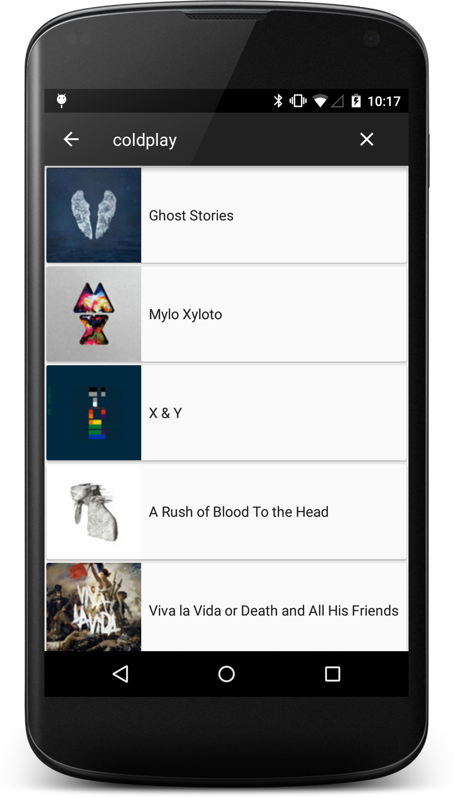

Introducing Kotlin For Android Development
==========================================

## Demo app for AnDevCon Santa Clara 2015 class
#### Search iTunes for Albums (without downloading)

The app demonstrates Kotlin code working with the popular Dagger 2, Retrofit 2, and RxJava/RxAndroid
(Java) libraries.

The no-frills but functional app allows the user to search for albums with the Search icon in the
action bar, enter a search term, then touch the soft keyboard's search icon (albums' text and
thumbnail images displayed).

Fetched entries are cached, so orientation changes do not necessitate making the api call to the
iTunes REST service again.

We converted the *AlbumSearchActivity* class to Kotlin from Java. For simplicity, the rest of the
demo app is left in Java.

We wrote a simple Java unit test class to test the Kotlin *AlbumSearchActivity* class.

Acknowledgement -- We used as starting point Mike Gouline's "Dagger 2 Demo" app that can be found at
[Android Samples repo](https://github.com/mgouline/android-samples), and then built it out.
Refer to the comments in the main AlbumSearchActivity.kt class for some background and other
acknowledgements.
